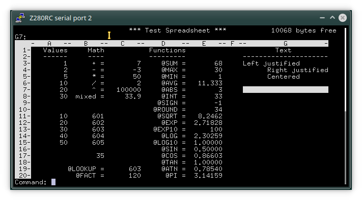

# Z80 FREECALC

This is a Z80 spreadsheet program for VT100-compatible terminals based on the Pascal program written and donated to Public Domain by Martin Burger. The original program was written in Oregon Pascal-2 for a DEC PDP-11 machine running the TSX+ or RT-11 OS, and is very similar in formula syntax, command set and functionality to the grandfather of all spreadsheet programs [Visicalc](https://en.wikipedia.org/wiki/VisiCalc).

This version can be built for both CP/M and RSX180/280, and differs from the original program in the following ways:

 * BCD floating point math is used for numeric computations.
 * Numeric values can be entered in exponential format.
 * More functions were added: @SIN, @COS, @ATN, @SIGN, @EXP, @EXP10, @LOG, @LOG10, @FACT, and constant @PI.
 * Fixed the @AVG function (in the original program items to be averaged were counted twice and therefore @AVG returned half of the correct value.)
 * The format of the saved spreadsheet file is different, and contains additional information like version, column widths, heading, etc.
 * Several new commands were added (see the Help file):
   * Erase single cell or range of cells.
   * Set numeric format (Number, Scientific or General).
   * Delete the entire spreadsheet.
   * Toggle color (experimental, for e.g. VT525 or xterm).

The [orig](orig) directory contains the original Pascal program, @AVG function bug included (see line 941 and 948: one of the two is superfluous and must be removed).

The [c](c) directory contains a C version of the Pascal program, but with the added features of the Z80 program and without the @AVG bug. The file format is also compatible with the Z80 version. But note that the C program internally uses standard C binary floating point math, and thus it may give different results than the Z80 version; the program simply converts BCD values to binary and vice-versa when reading/saving the spreadsheet file.

